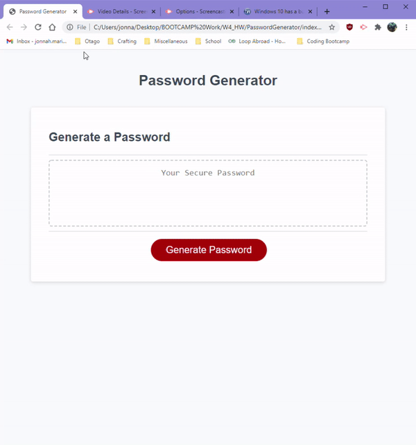

# Password Generator

This project aimed to create a random string of characters via a password generator based on criteria that a user selected.

Users can select:
* Password character length (between 8-128 characters)
* Character types, such as:
  - Uppercase letters
  - Lowercase letters
  - Numeric characters
  - Symbols

The project made use of JavaScript to enable this output via an addEventListener on the generate button.

[Live Website](https://jonnahmarie.github.io/PasswordGenerator/)

Demo Gif of Random Password Generator:
